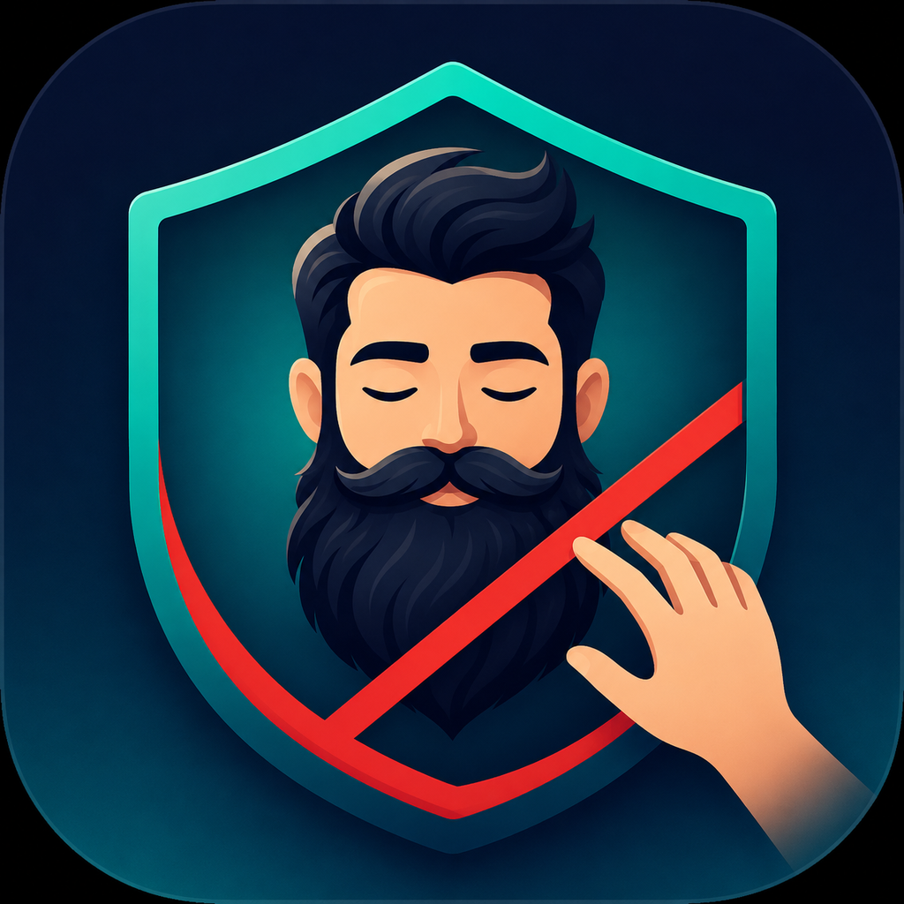
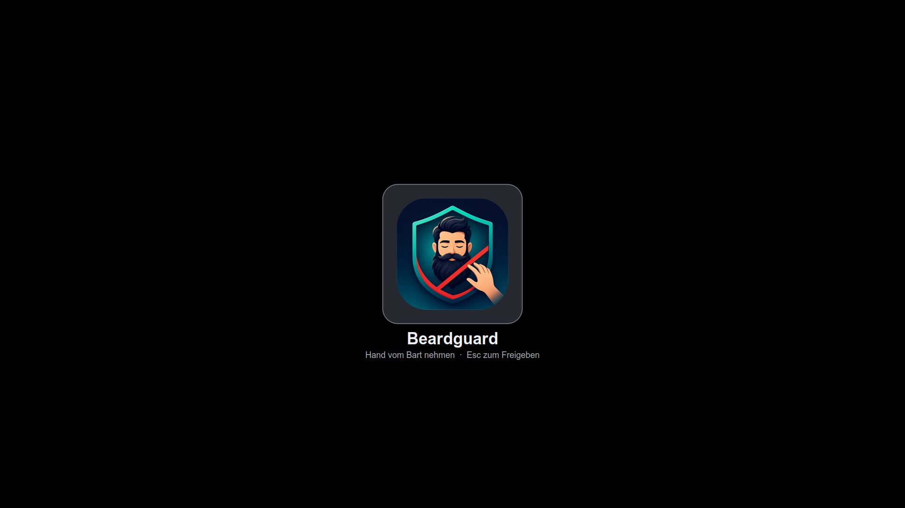

<div align="center">
  

# Beardguard

A local webcam reminder to keep your hands away from your beard while you work.

[Quick start](#quick-start) · [Using Beardguard](#using-beardguard) · [Configuration](#configuration) · [Troubleshooting](#troubleshooting) · [Tests](#tests)

</div>

Beardguard uses MediaPipe face and hand landmarks to detect when a fingertip enters the beard area. It covers your active monitors with a branded warning and plays a random alarm. Move your hand away to return to your desktop.

- **Immediate feedback:** no intentional hold delay; the detection zone includes the upper beard near the ears.
- **Every active monitor:** a centered logo in a rounded gray frame makes the source of the warning clear.
- **An escape route:** press **Esc** to dismiss the visual warning, including when another window has keyboard focus.
- **Local processing:** the app does not record video, upload camera frames, or take desktop screenshots.
- **No shaking or display switching:** the warning uses reusable overlay windows, not monitor power controls.

<details>
<summary>See the warning overlay</summary>



The same warning is centered independently on each active monitor. This example was captured on an isolated test display, not a user's desktop.

</details>

> [!IMPORTANT]
> The multi-monitor overlay and keyboard handling are tested on **Linux/X11**. The code includes Windows and macOS audio backends, but the complete desktop experience on those systems and on Wayland is not currently verified. Beardguard is a habit reminder, not a screen lock.

## Quick start

You need a webcam, a graphical desktop, audio output, and Python with Tkinter. The current setup is tested with **Python 3.12 on Ubuntu/X11**.

### 1. Install desktop dependencies

On Ubuntu/Debian:

```bash
sudo apt install python3-venv python3-tk libgl1 libglib2.0-0 libportaudio2 \
  x11-xserver-utils pulseaudio-utils
```

`xrandr` discovers the active monitors; `paplay` plays the alarms. The application falls back to `aplay` if `paplay` is unavailable.

### 2. Clone and install Python packages

```bash
git clone https://github.com/applifaction/beard-guard.git
cd beard-guard
python3 -m venv venv
source venv/bin/activate
python -m pip install --upgrade pip
python -m pip install "mediapipe==0.10.14" "opencv-contrib-python==4.12.0.88" "Pillow==11.3.0"
```

These package versions match the tested environment. Beardguard uses MediaPipe's `mp.solutions` API; do not assume every newer release is compatible. Use the GUI-enabled OpenCV package above, **not** a headless build. `opencv-contrib-python` provides the `cv2` module, so a separate `opencv-python` installation is unnecessary.

### 3. Run

```bash
python beard_guard.py
```

Alternatively, after creating `venv`, run `bash beardguard.sh` from the project directory. Keep your face and fingertips visible to the webcam. The default camera is device `0`.

> [!CAUTION]
> An active warning covers your screens and temporarily captures keyboard and pointer input. **Move your hand away or press Esc to release it.** Try this behavior before adding Beardguard to autostart.

## Using Beardguard

| Action or event | Result |
| --- | --- |
| A fingertip enters the detection zone | All detected active monitors show the warning. There is no added hold delay, but camera and inference latency still apply. |
| You move your hand away | The overlays disappear and the current alarm stops. |
| You press **Esc** during a warning | The visual warning is dismissed without stopping camera detection. It rearms after **1 second of continuously safe camera frames**, not after a single missed detection. |
| Face or hand tracking is lost | The overlays are released. |
| Camera processing stops delivering updates | A safety timeout releases the overlays after **1 second**. |
| You close the preview, or press **Esc** in the focused preview with your hand away | Beardguard exits and cleans up its overlay windows. |

Audio is independent of the visual warning: each sound lasts at most two seconds and may repeat while your hand stays near your beard. Esc dismisses the **overlay**, not the audio warning.

The preview marks your fingertip and chin, with a red safety line below your chin. Detection uses image coordinates rather than physical distance or depth. Currently, the first detected face and hand are evaluated.

### Start at login

After testing, add the following command to your desktop's Startup Applications, replacing both paths with your checkout's absolute path:

```text
/absolute/path/beard-guard/venv/bin/python /absolute/path/beard-guard/beard_guard.py
```

Stop Beardguard before a video call if the conferencing app needs exclusive access to the webcam, then restart it afterward.

## Configuration

Edit the constants in [`beard_guard.py`](beard_guard.py), then restart the application.

| Setting | Default | Effect |
| --- | --- | --- |
| `TRIGGER_HOLD_DURATION` | `0.0` | Seconds a hand must remain too close before warning. Zero triggers on the first qualifying frame. |
| `HAND_Y_THRESHOLD_FACTOR` | `1.0` | Upper boundary relative to eye height. `1.0` includes the upper beard near the ears; larger values move the boundary downward. |
| `DISTANCE_THRESHOLD_FACTOR` | `1.0` | Maximum chin-to-fingertip distance, relative to face width. Larger values widen the detection zone. |
| `CHIN_LINE_OFFSET_FACTOR` | `0.4` | Extends the lower boundary below the chin by 40% of the chin-to-nose distance. |
| `SCREEN_BLACKOUT_ENABLED` | `True` | Enables the desktop overlay. Set to `False` for audio-only reminders. |
| `SCREEN_BLACKOUT_RELEASE_TIMEOUT` | `1.0` | Releases an overlay when camera updates stop. This is **not** a maximum warning duration. |
| `alarm_cooldown` | `2` | Seconds between alarm starts and the maximum duration of each sound. |

The Esc rearm interval is the `rearm_duration` constructor parameter in [`screen_blackout.py`](screen_blackout.py), defaulting to one second. Changing it does not change the normal zero-delay trigger.

### Sounds and appearance

- Add or replace **`.wav` files in [`alarms/`](alarms/)** to customize the random audio reminders. With no WAV files, visual warnings still work.
- The overlay uses [`assets/icons/beardguard.png`](assets/icons/beardguard.png). Its rounded frame is rendered in [`blackout_branding.py`](blackout_branding.py) and cached per required size.
- On Linux/X11, monitor discovery reads the current server configuration without a slow hardware reprobe. Display layout changes are picked up on the next overlay activation.

## Troubleshooting

| Symptom | What to check |
| --- | --- |
| No camera preview, or the app exits immediately | Close other camera apps, check webcam permissions, or change `cv2.VideoCapture(0)` to the correct device index. |
| Missing `mp.solutions` or import errors | Activate the project virtual environment and install the package versions listed above. |
| Missing Tkinter or an OpenCV GUI error | Install `python3-tk`, use a graphical session, and avoid headless OpenCV packages. |
| Detection is late or misses your hand | Check lighting and keep your face and fingertips in view. The trigger delay is already zero; tracking and camera latency remain. |
| Only part of the desktop is covered | Check your session with `echo "$XDG_SESSION_TYPE"` and the active display layout with `xrandr --query --current`. Multi-monitor behavior outside X11 is not verified. |
| No sound | Check `alarms/*.wav`, your output volume, and `paplay`/`aplay` on Linux. macOS uses `afplay`; Windows uses `winsound`. |
| The warning stays dismissed after Esc | Move your hand away for at least one second so the visual warning can rearm. |
| A menu or dialog temporarily prevents the overlay | Another application may own an input grab. Beardguard leaves the desktop accessible and retries when the grab is released. |

## Tests

Run GUI tests on a virtual display so they do not cover your real desktop or capture its input:

```bash
sudo apt install xvfb xauth xdotool x11-xserver-utils
xvfb-run -a -s '-screen 0 1280x1024x24' ./venv/bin/python -m unittest discover -s tests -v
```

Tests cover immediate triggering, tracking loss, camera stalls, logo placement on two monitor regions, Esc with another application focused, input release, recovery from grab conflicts, and bounded X11 connections across 100 overlay cycles. Camera-loop tests replay landmark results without using a real webcam.

## Project layout

| Path | Responsibility |
| --- | --- |
| [`beard_guard.py`](beard_guard.py) | Camera processing, detection thresholds, audio, and preview. |
| [`screen_blackout.py`](screen_blackout.py) | Overlay lifecycle, Esc handling, input grabs, and safety timeouts. |
| [`blackout_branding.py`](blackout_branding.py) | Rounded logo artwork, without desktop capture. |
| [`desktop_monitors.py`](desktop_monitors.py) | Active display geometry and virtual-desktop fallback. |
| [`tests/`](tests/) | Camera-loop, monitor-discovery, and isolated GUI regression tests. |
